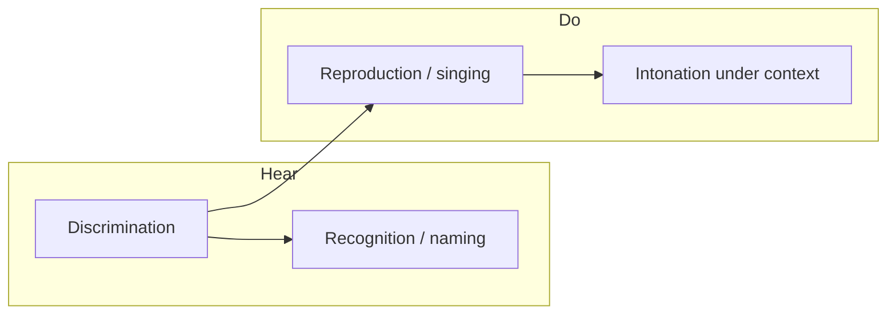

# Ear Training — Product Roadmap

Browser-based ear training for singers: harmony, pitch recognition, and vocal reproduction. **Rhythm is out of scope.** All other aspects of harmony and note work are potentially in scope.

## Goals

- **Regular practice** — short, repeatable sessions with clear daily targets
- **Measurable improvement** — history, trends, and weak-area visibility
- **Progressive difficulty** — simple intervals → diatonic context → richer harmony → atonal clusters
- **Hear and do** — not only singing back pitches, but identifying what was heard

## Naming & labeling (product decision)

- **No solfege** (no movable-do syllables such as do, re, mi).
- Support two answer vocabularies over time:
  1. **Scale degrees** (primary) — e.g. *2nd*, *5th*, *minor 7th*, *raised 4th*, *flat 6th*. Tied to an established key or tonal center.
  2. **Note names** (secondary, harder) — e.g. *C*, *D*, *E♭*. Requires absolute or key-relative pitch class naming; introduce after degree-based recognition is solid.
- **Rollout order:** build recognition and curriculum around **scale degrees first**; add **note-name** variants as an optional harder mode on the same exercises (not a separate product path).

## Current state (baseline)

| Area | Status |
|------|--------|
| **Exercises** | **Sing:** single note; chord middle (major / minor / diminished); melodic & harmonic intervals (sing upper note); **scale degrees in key** (tonic → sing 4th / 5th / octave). **Identify:** melodic & harmonic intervals (multiple choice, degree-style interval names). Seven routes; metadata in [`src/exercises/registry.ts`](../src/exercises/registry.ts). |
| **Scoring** | **Sing:** mic → median pitch → cents vs target (40¢ tolerance), harmonic correction, octave hints. **Identify:** pass/fail on selected interval label (no mic); `centsOff` stored as 0. |
| **Session shape** | 10-question rounds, up to 3 attempts per question, in-round summary (`firstTry` / `retry` / `wrong`) — sing and identify flows |
| **Personalization** | Voice type range; chord type & inversion filters; **interval set** filter (P4 / P5 / octave in v1 registry); **scale-degree set** filter (4th / 5th / octave in v1) — all `localStorage` |
| **Persistence** | Preferences in `localStorage`; **attempt history** in IndexedDB (`src/history/`) — per attempt: `exerciseId`, target, `centsOff`, pass/fail, chord meta, **`intervalId`** / presentation / selected answer for ID exercises, **`degreeId`** / `tonicMidi` for scale-degree sing, `roundId` + `questionIndex` |
| **Stats / dashboard** | [`/stats/`](stats/index.html) — overall + per-exercise for all seven `exerciseId`s; **weakness breakdown** by `intervalId`, `degreeId`, and chord type (weakest first). Overall / sing sections use median ¢; identify sections omit median. **No** time trends yet. |
| **Recognition / naming** | **Partial** — interval identification only (perfect 4th / 5th / octave labels); scale-degree **sing** in key (v1 pool); no scale-degree ID, triad quality, or note names |
| **Curriculum (v1 shell)** | **Done** — home at `/` shows **Continue**, **Level 1** (single note) → **Level 2** (intervals) → **Level 3** (scale-degree sing), and **Free practice** (`chord-middle`). Unlock from IndexedDB via [`src/curriculum/unlock.ts`](../src/curriculum/unlock.ts) (≥10 questions, ≥70% question pass rate on predecessor). Locked path exercises are non-links on home; direct URLs show a locked page via [`src/ui/exercise-page.ts`](../src/ui/exercise-page.ts). Thresholds are constants, not user-configurable. |
| **Testing** | **Partial (T3)** — Node unit tests + **browser** orchestration for all seven registry exercises (round flows + registry smokes), registry contract test, dev `?unlock=all`. **CI:** `npm test`, `npm run test:browser`, `npm run build`. **Next:** [T4](testing-roadmap.md#phase-t4---optional-hardening) (optional hardening). |

Relevant code seams: exercise registry + `mountExercisePage` guard; `CURRICULUM_LEVELS` / `CURRICULUM_PATH` in [`src/curriculum/levels.ts`](../src/curriculum/levels.ts); `computeExerciseProgress` in [`src/history/stats.ts`](../src/history/stats.ts); `SingTestConfig`, `IdentifyTestConfig`, `RoundSummary`, chord/voice/**interval**/**scale-degree** preferences; interval domain in `src/interval-config.ts`, `src/interval-questions.ts`, `src/ui/interval-tests.ts`; scale-degree domain in `src/scale-degree-config.ts`, `src/scale-degree-questions.ts`, `src/ui/scale-degree-tests.ts`.

## Testing (summary)

Full plan: [`docs/testing-roadmap.md`](testing-roadmap.md).

- **Today:** Vitest in Node covers scoring, generation, unlock rules, and stats. Vitest **browser** mode covers curriculum guards plus **identify**, **single-note**, and **scale-degree** sing orchestration (ports + test config hooks; fake recording uses real `scoreFromSamples`). **CI** runs `npm test`, `npm run test:browser`, and `npm run build` on every PR and `main`.
- **Direction:** [Vitest browser mode](https://vitest.dev/guide/browser/) (real Chromium); **no** jsdom/happy-dom UI tests; **no** mocking `smplr` / `pitchy` or audio modules — inject **ports** at `mount*` boundaries (`HistoryPort`, `AudioPort`, `RecordingPort`, etc.) alongside existing config hooks (`prepareQuestion`, `playReference`).
- **Phases (testing):** ~~**T-CI**~~ **Done** → ~~**T0**~~ **Done** → ~~**T1**~~ **Done** → ~~**T2**~~ **Done** → ~~**T3**~~ **Done** (registry contract, smokes, `?unlock=all`) → **T4 next** (optional). Manual QA remains for mic, permissions, and timbre.

## Product pillars

Four skills (rhythm excluded):

| Pillar | Description | Today |
|--------|-------------|--------|
| **Discrimination** | Hear differences (wider vs narrower interval, maj vs min) | Partial (chord types; interval ID exercises with user-selected interval pool) |
| **Recognition / naming** | Hear → label (degree or note name) | **Partial** — interval names (P4 / P5 / octave); no key context or chord-quality ID |
| **Reproduction** | Hear → sing back accurately | Core strength (single note, chord middle, interval upper note, **scale degrees from tonic**) |
| **Contextual intonation** | Phrases, tendency tones, chord tones in key | **Partial** — Level 3 establishes tonic before singing a degree; no phrases or functional harmony yet |

## Phased roadmap

### Phase 0 — Measurement & habit (technical foundation)

**Goal:** Regular practice and visible improvement before adding many exercise types.

| Feature | Status | Notes |
|---------|--------|--------|
| Persist attempt history | **Done** | IndexedDB store; per attempt: `exerciseId`, target, `centsOff`, pass/fail, attempt number, timestamp, voice type, chord notes/type/inversion, interval fields, active filter snapshot, `roundId` + `questionIndex`. See `src/history/`. |
| Dashboard | **Done (MVP+)** | `/stats/`: attempt pass rate, question pass rate, first-try rate; median ¢ on sing exercises only; per-exercise **by-tag** breakdown (interval / degree / chord type). Time trends not yet. |
| Skill profiles | **Done (lite)** | Separate stats per `exerciseId` on the dashboard. |
| Practice goals & streaks | Todo | e.g. daily question count or minutes; optional notifications later. |
| Targeted drills | Todo | Weight generation toward missed tags (chord type, **interval id**, register, degree, etc.) — interval id is already persisted but not used for drill weighting. |
| Configurable difficulty | Todo | Tolerance (¢), range width, playback repeats — driven by level/settings, not only `config.ts`. |
| Automated UI regression | **Partial (T3)** | Browser tests for curriculum guards, all registry exercise smokes, identify/sing rounds; registry contract in Node. Domain tests cover stats/unlock math. |
| CI on every PR | **Done** | [`.github/workflows/ci.yml`](../.github/workflows/ci.yml) — `npm test`, `npm run test:browser`, `npm run build`; see [T-CI](testing-roadmap.md#phase-t-ci---github-actions-baseline) + [T0](testing-roadmap.md#phase-t0---foundation-tooling--first-ports) |

**Musical content:** interval exercises now feed the same history/stats pipeline as earlier sing tests; habit features (goals, adaptive drills) still TODO.

---

### Phase 1 — Curriculum spine (progressive difficulty)

**Goal:** Structured path from simple → complex; user follows levels instead of only picking a test card.

| Level | Reproduction (sing) | Recognition (hear → answer) |
|-------|---------------------|-----------------------------|
| 1 | Single note *(done)* | — |
| 2 | Intervals: melodic, then harmonic *(done, partial)* | Interval as degree *(done, partial)* |
| 3 | Scale degrees in one key: sing 4th, 5th, octave from established tonic *(done, partial)* | **Degree ID** — deferred until pool diverges from interval ID |
| 4 | Diatonic triads: sing root / 3rd / 5th (extend beyond middle only) | Triad quality: major / minor / diminished |
| 5 | Triads + inversions | Inversion: root / 1st / 2nd |
| 6 | Seventh chords; sing requested chord tone | Quality + inversion ID |
| 7 | Short diatonic melodies (3–5 notes) | Melodic dictation via **degrees** |
| 8 | Chromatic / non-diatonic tones in context | “Which degree?” with altered labels (*flat 5*, *sharp 4*, etc.) |
| 9 | Dense / atonal clusters | Cluster: which pitch class or degree was added? |

**Level 2 — what shipped vs gaps**

| Shipped | Still open |
|---------|------------|
| `/interval-melodic-sing/`, `/interval-harmonic-sing/` — hear interval, sing **upper** note | Sing lower note or both directions; “reproduce the interval” beyond upper-target scoring |
| `/interval-melodic-id/`, `/interval-harmonic-id/` — MC with degree-style labels (no solfege) | Broader interval registry (2nds, 3rds, 6ths, 7ths, chromatic); confusion-pair drills |
| v1 pool: perfect 4th, 5th, octave (`src/interval-config.ts`) | **Session-enforced** interval pool per level (unlock only gates *which exercise*, not which intervals appear in a round) |
| User interval picker + voice range (`interval-preference`) | — |
| Guided path order: melodic sing → harmonic sing → melodic ID → harmonic ID | Merging sing/identify UIs; mixed-level rounds |
| Unlock from history (10 questions, 70% question pass rate on predecessor) | Configurable thresholds in UI; dev **`?unlock=all`** for QA *(done)* |
| Home curriculum UI + page guard on locked routes | `chord-middle` on main path (stays **free practice** until triad level) |

**Technical:** [`src/exercises/registry.ts`](../src/exercises/registry.ts) wraps all seven exercises; unlock + levels in `src/curriculum/`. Unified `ExerciseDefinition` with shared `prepareQuestion` / `score` — still TODO (parallel `SingTestConfig` / `IdentifyTestConfig` per page).

**Note-name variant (later within Phase 1+):** same exercises with answers *C*, *F♯*, etc., unlocked as harder mode after degree mode is stable.

---

### Phase 2 — Recognition-first modes (hear → answer, no mic)

**Goal:** Ear training is not only “sing it back.”

| Exercise type | Answer format (v1) | Status |
|---------------|--------------------|--------|
| Interval identification | Interval name / degree span (*Perfect 5th*, etc.) | **Done (partial)** — melodic + harmonic pages; limited interval set; distractors from active picker (min 2 intervals) |
| Scale degree in key | *3rd*, *minor 7th*, *flat 6th*, etc. | **Sing (partial)** — `/scale-degree-sing/` with v1 pool; **ID deferred** (same spans as interval ID today) |
| Chord quality | Major / minor / dim / aug | Todo |
| Chord inversion | Root / 1st / 2nd | Todo |
| Tonic / key | Establish key → identify degree of a note or chord function | Todo |
| Confusion pairs | Extra drills for commonly confused pairs (e.g. M6 vs m7) | Todo |

**Harder variants (later):** note name in key for scale-degree exercises; note-name key labels optional for tonic/key.

**Technical:** `IdentifyTestConfig` + `mountIdentifyTest` implement select-based scoring and shared round/history with sing tests. Still TODO: unify under `responseMode: "sing" \| "select"` on a single `ExerciseDefinition`; keyboard/MIDI input.

---

### Phase 3 — Context & musicianship (still no rhythm)

| Feature | Notes |
|---------|--------|
| Tonal center | Drone, cadence, or I–V–I before degree-based questions |
| Functional harmony | Hear IV or V; identify or sing a requested tone |
| Tendency tones | 7→1, 4→3 — sing resolution |
| Live intonation feedback | Continuous cents display while holding a note |
| Phrase scoring | Per-note pass on short patterns |
| Timbral variety | Additional reference sounds beyond piano |
| A cappella mode | Limited replays to stress memory |

---

### Phase 4 — Platform & polish (optional / later)

| Area | Ideas |
|------|--------|
| Sync / accounts | Only if multi-device matters; local-first is fine for v1 |
| Export | Session CSV for teachers |
| MIDI keyboard | Answer recognition exercises without mouse |
| Sight connection | Show notation after successful ID (ear ↔ score) |
| Two-part hearing | Hold harmony against reference (harder technically) |

---

## Gap matrix

| Need | Technical | Musical |
|------|-----------|---------|
| Regular practice | Goals, streaks, reminders | Short daily mixed drill |
| Measurable improvement | History + `/stats/` with per-tag weakness (interval, degree, chord type); ID exercises omit median ¢; **time trends still TODO** | Per-skill benchmarks *(lite: per exercise id + tags)* |
| Progressive difficulty | **Curriculum v1 done** — levels 1–3 path, history unlock, home + guards; level 4+ not started | Level 2–3 content partial (P4/P5/8ve pools); per-level pool enforcement still TODO |
| Naming / recognition | Select UI + interval ID exercises **done (partial)**; scale-degree **sing** in key **done (partial)**; scale-degree ID & chord ID **TODO** | Degrees-first interval labels **done (partial)**; note names **TODO** |
| Not only reproduction | Interval ID **done (partial)**; phrase scoring, multi-target rounds **TODO** | Dictation, functional hearing **TODO** |
| Singer-specific | Range by voice; phrase intonation | Register-aware sets; no rhythm track |
| Regression safety as features grow | **Partial (T3)** — CI + browser coverage for all registry exercises + contract test; T4 optional hardening | Manual full-path QA still needed for mic, permissions, timbre |

---

## Suggested build order

1. ~~**Persist results + dashboard** (Phase 0)~~ **Done**
2. ~~**Interval sing + interval recognition (degree labels)** (Phase 1–2)~~ **Done (partial)** — P4/P5/octave, four routes, history + stats. **Remaining:** expand intervals, targeted drills (tags now visible on dashboard), richer reproduction tasks.
3. ~~**Curriculum / levels (v1 shell)**~~ **Done** — registry, levels 1–2 path, history unlock, curriculum home, page guards, free practice for `chord-middle`.
4. ~~**Scale-degree sing in key** (Level 3)~~ **Done (partial)** — `/scale-degree-sing/`, tonic → prompt → sing; v1 pool 4th/5th/octave. **Remaining:** degree ID (when pool diverges from interval ID), expand degrees with interval pool.
5. **Expand chord exercises** (sing other chord tones; quality/inversion ID)
6. **Melodic dictation & clusters** (degrees → note-name hard mode)
7. **Adaptive / spaced drills** once item taxonomy is rich enough

**Testing (parallel where possible):**

0. ~~[T-CI](testing-roadmap.md#phase-t-ci---github-actions-baseline)~~ — **Done** — GitHub Actions on PRs and `main`
1. ~~[T0](testing-roadmap.md#phase-t0---foundation-tooling--first-ports)~~ — **Done** — Vitest browser project, `HistoryPort`, home + locked-page + stats browser tests, Playwright in CI
2. ~~[T1](testing-roadmap.md#phase-t1---identify-exercise-orchestration)~~ — **Done** — identify round + `saveAttempt` in browser
3. ~~[T2](testing-roadmap.md#phase-t2---sing-exercise-orchestration)~~ — **Done** — fake `RecordingPort`, sing pass/fail paths
4. ~~[T3](testing-roadmap.md#phase-t3---scale-with-product-features)~~ — **Done** — per-exercise smoke, `?unlock=all`, registry contract

---

## Architectural direction

- Generalize `SingTestConfig` / `IdentifyTestConfig` → `ExerciseDefinition` with pluggable `prepareQuestion`, `playReference`, `score(response)` and `responseMode`.
- ~~Persist scored attempts + question snapshots to history store.~~ **Done** — `saveAttempt` on each score (sing and identify); round outcomes still ephemeral in UI only.
- ~~**Curriculum spine (v1).**~~ **Done** — `EXERCISES` registry, `CURRICULUM_PATH` / unlock from `computeExerciseProgress`, async home + `mountExercisePage` guard.
- ~~Extend dashboard with weakness tags (e.g. by `intervalId`).~~ **Done** — [`src/history/tag-stats.ts`](../src/history/tag-stats.ts), `/stats/` UI. **Next:** trends; optional round-level aggregates; targeted drill weighting from tags.
- Reuse preference patterns (`voice-ranges`, `chord-type-preference`, `interval-preference`) for **per-level interval pools** and **enabled skills** (v1 unlock does not override session interval picker).
- ~~Implement **recognition** as sibling modes sharing playback and question generation.~~ **Partial** — `identify-test.ts` shares rounds/history with sing tests; interval playback/questions shared via `interval-questions.ts`; registry lists `responseMode` but sing/identify mount paths remain separate.
- **Testability at UI boundaries** — **Partial (T2):** `HistoryPort` + `AudioPort` on `mountIdentifyTest`; `HistoryPort` + `AudioPort` + `RecordingPort` on `mountSingTest`; `HistoryPort` on home, exercise page, and stats. Enables [browser orchestration tests](testing-roadmap.md#dependency-ports-enabler) without mocking vendor audio libs.

### Curriculum v1 — intentional gaps (post–levels shell)

| Gap | Why deferred |
|-----|----------------|
| Unified `ExerciseDefinition` with `prepareQuestion` / `score` on one type | Registry wrapper is enough; sing/identify UI merge is high churn |
| Enforced interval pool per level | Would need session-scoped override of `interval-preference.ts`; v1 only gates which exercise |
| Melodic-before-harmonic beyond unlock order | Path order only; user can still pick intervals freely inside an unlocked exercise |
| `chord-middle` in main path | Free practice until level 4 triads |
| Level 4+ placeholders | No exercises yet |
| Mixed-level rounds | Per-exercise rounds unchanged |
| Goals, streaks, adaptive drills | Phase 0 |
| Weakness stats by `intervalId` | **Done** on `/stats/`; drill weighting still TODO |
| Configurable unlock thresholds in UI | Constants in `unlock.ts` |
| Dev `?unlock=all` | **Done** — [`src/curriculum/dev-unlock.ts`](../src/curriculum/dev-unlock.ts); access-only; see [testing roadmap manual QA](testing-roadmap.md#manual-qa-notes) |

---

## Explicitly out of scope

- Rhythm, meter, tempo, rhythmic dictation
- Solfege (movable-do syllables)
- Full sight-reading curriculum
- AI accompaniment or automatic part extraction
- Polyphonic scoring (multiple simultaneous sung pitches)
