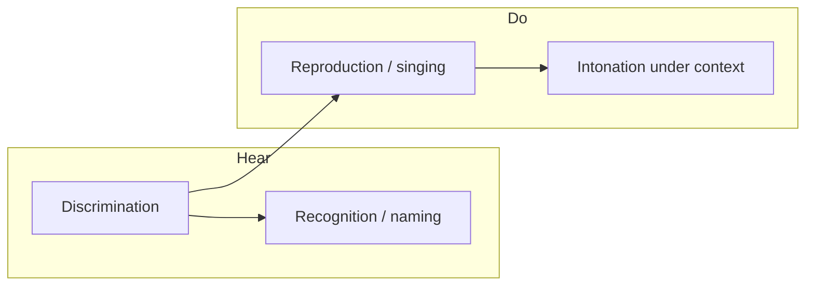

# Ear Training — Product Roadmap

Browser-based ear training for singers: harmony, pitch recognition, and vocal reproduction. **Rhythm is out of scope.** All other aspects of harmony and note work are potentially in scope.

## Goals

- **Regular practice** — short, repeatable sessions with clear daily targets
- **Measurable improvement** — history, trends, and weak-area visibility
- **Progressive difficulty** — simple intervals → diatonic context → richer harmony → atonal clusters
- **Hear and do** — not only singing back pitches, but identifying what was heard

## Naming & labeling (product decision)

- **No solfege** (no movable-do syllables such as do, re, mi).
- Support two answer vocabularies over time:
  1. **Scale degrees** (primary) — e.g. *2nd*, *5th*, *minor 7th*, *raised 4th*, *flat 6th*. Tied to an established key or tonal center.
  2. **Note names** (secondary, harder) — e.g. *C*, *D*, *E♭*. Requires absolute or key-relative pitch class naming; introduce after degree-based recognition is solid.
- **Rollout order:** build recognition and curriculum around **scale degrees first**; add **note-name** variants as an optional harder mode on the same exercises (not a separate product path).

## Current state (baseline)

| Area | Status |
|------|--------|
| **Exercises** | Sing a single note; sing the middle note of a triad (major / minor / diminished) |
| **Scoring** | Mic → median pitch → cents vs target (40¢ tolerance), harmonic correction, octave hints |
| **Session shape** | 10-question rounds, up to 3 attempts per question, in-round summary (`firstTry` / `retry` / `wrong`) |
| **Personalization** | Voice type range; chord type & inversion filters (`localStorage`) |
| **Persistence** | Preferences only — **no** stored attempt history or long-term stats |
| **Recognition / naming** | Not implemented — reproduction only |
| **Curriculum** | Manual test choice from home — no unlock progression |

Relevant code seams: `SingTestConfig`, `RoundSummary`, `SingTestQuestion`, chord/voice preferences in `localStorage`.

## Product pillars

Four skills (rhythm excluded):

| Pillar | Description | Today |
|--------|-------------|--------|
| **Discrimination** | Hear differences (wider vs narrower interval, maj vs min) | Partial (chord types) |
| **Recognition / naming** | Hear → label (degree or note name) | Missing |
| **Reproduction** | Hear → sing back accurately | Core strength |
| **Contextual intonation** | Phrases, tendency tones, chord tones in key | Missing |

## Phased roadmap

### Phase 0 — Measurement & habit (technical foundation)

**Goal:** Regular practice and visible improvement before adding many exercise types.

| Feature | Notes |
|---------|--------|
| Persist attempt history | Per question: exercise id, target(s), cents error, pass/fail, attempts, timestamp, voice range, chord metadata. Prefer IndexedDB over `localStorage` for volume. |
| Dashboard | Accuracy %, median cents error, first-try rate, breakdown by exercise and by weakness tags. |
| Practice goals & streaks | e.g. daily question count or minutes; optional notifications later. |
| Skill profiles | Separate stats per exercise id, not one global score. |
| Targeted drills | Weight generation toward missed tags (chord type, register, degree, etc.). |
| Configurable difficulty | Tolerance (¢), range width, playback repeats — driven by level/settings, not only `config.ts`. |

**Musical content:** none new — make existing exercises count.

---

### Phase 1 — Curriculum spine (progressive difficulty)

**Goal:** Structured path from simple → complex; user follows levels instead of only picking a test card.

| Level | Reproduction (sing) | Recognition (hear → answer) |
|-------|---------------------|-----------------------------|
| 1 | Single note *(done)* | — |
| 2 | Intervals: melodic, then harmonic (P4, P5, octave first) | **Interval as degree** — e.g. *perfect 5th* / *minor 2nd* (not solfege) |
| 3 | Scale degrees in one key: sing 2nd, 5th, etc. from established tonic | **Degree ID** — hear note in key → choose degree (and quality where needed, e.g. *minor 7th*) |
| 4 | Diatonic triads: sing root / 3rd / 5th (extend beyond middle only) | Triad quality: major / minor / diminished |
| 5 | Triads + inversions | Inversion: root / 1st / 2nd |
| 6 | Seventh chords; sing requested chord tone | Quality + inversion ID |
| 7 | Short diatonic melodies (3–5 notes) | Melodic dictation via **degrees** |
| 8 | Chromatic / non-diatonic tones in context | “Which degree?” with altered labels (*flat 5*, *sharp 4*, etc.) |
| 9 | Dense / atonal clusters | Cluster: which pitch class or degree was added? |

**Technical:** `ExerciseDefinition` registry; unlock rules from rolling accuracy + minimum reps.

**Note-name variant (later within Phase 1+):** same exercises with answers *C*, *F♯*, etc., unlocked as harder mode after degree mode is stable.

---

### Phase 2 — Recognition-first modes (hear → answer, no mic)

**Goal:** Ear training is not only “sing it back.”

| Exercise type | Answer format (v1) | Harder variant (later) |
|---------------|--------------------|-------------------------|
| Interval identification | Interval name / degree span (*minor 6th*) | — |
| Scale degree in key | *3rd*, *minor 7th*, *flat 6th*, etc. | Note name in key |
| Chord quality | Major / minor / dim / aug | — |
| Chord inversion | Root / 1st / 2nd | — |
| Tonic / key | Establish key → identify degree of a note or chord function | Note-name key labels optional |
| Confusion pairs | Extra drills for commonly confused pairs (e.g. M6 vs m7) | — |

**Technical:** `responseMode: "sing" | "select"` (and later keyboard/MIDI); shared playback and question generation with reproduction modes.

---

### Phase 3 — Context & musicianship (still no rhythm)

| Feature | Notes |
|---------|--------|
| Tonal center | Drone, cadence, or I–V–I before degree-based questions |
| Functional harmony | Hear IV or V; identify or sing a requested tone |
| Tendency tones | 7→1, 4→3 — sing resolution |
| Live intonation feedback | Continuous cents display while holding a note |
| Phrase scoring | Per-note pass on short patterns |
| Timbral variety | Additional reference sounds beyond piano |
| A cappella mode | Limited replays to stress memory |

---

### Phase 4 — Platform & polish (optional / later)

| Area | Ideas |
|------|--------|
| Sync / accounts | Only if multi-device matters; local-first is fine for v1 |
| Export | Session CSV for teachers |
| MIDI keyboard | Answer recognition exercises without mouse |
| Sight connection | Show notation after successful ID (ear ↔ score) |
| Two-part hearing | Hold harmony against reference (harder technically) |

---

## Gap matrix

| Need | Technical | Musical |
|------|-----------|---------|
| Regular practice | Goals, streaks, reminders | Short daily mixed drill |
| Measurable improvement | History, charts, weakness map | Per-skill benchmarks |
| Progressive difficulty | Curriculum engine, unlock rules | Ordered content (see Phase 1 table) |
| Naming / recognition | Select UI, exercise types, no-mic path | Degrees first; note names second |
| Not only reproduction | Phrase scoring, multi-target rounds | Dictation, functional hearing |
| Singer-specific | Range by voice; phrase intonation | Register-aware sets; no rhythm track |

---

## Suggested build order

1. **Persist results + dashboard** (Phase 0)
2. **Interval sing + interval recognition (degree labels)** (Phase 1–2)
3. **Curriculum / levels** wrapping existing + new exercises
4. **Scale-degree sing + degree ID** (primary naming track)
5. **Expand chord exercises** (sing other chord tones; quality/inversion ID)
6. **Melodic dictation & clusters** (degrees → note-name hard mode)
7. **Adaptive / spaced drills** once item taxonomy is rich enough

---

## Architectural direction

- Generalize `SingTestConfig` → `ExerciseDefinition` with pluggable `prepareQuestion`, `playReference`, `score(response)`.
- Persist `RoundSummary` + question snapshots to history store.
- Reuse preference patterns (`voice-ranges`, `chord-type-preference`) for **curriculum level** and **enabled skills**.
- Implement **recognition** as sibling modes sharing playback and question generation, not a separate app.

---

## Explicitly out of scope

- Rhythm, meter, tempo, rhythmic dictation
- Solfege (movable-do syllables)
- Full sight-reading curriculum
- AI accompaniment or automatic part extraction
- Polyphonic scoring (multiple simultaneous sung pitches)
