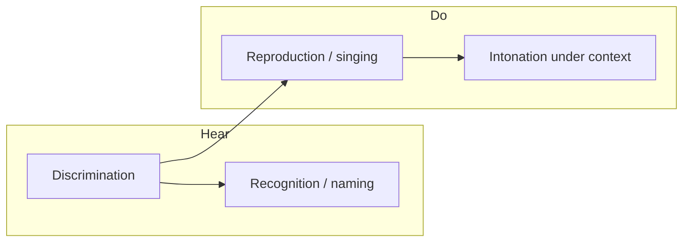

# Ear Training — Product Roadmap

Browser-based ear training for singers: harmony, pitch recognition, and vocal reproduction. **Rhythm is out of scope.** All other aspects of harmony and note work are potentially in scope.

## Goals

- **Regular practice** — short, repeatable sessions with clear daily targets
- **Measurable improvement** — history, trends, and weak-area visibility
- **Progressive difficulty** — two axes: **which exercise/mode** (e.g. melodic sing vs harmonic ID) and **which content tier** within it (e.g. P4/P5/8ve → diatonic major scale intervals → wider pools); see [Progressive difficulty model](#progressive-difficulty-model)
- **Hear and do** — not only singing back pitches, but identifying what was heard

## Naming & labeling (product decision)

- **No solfege** (no movable-do syllables such as do, re, mi).
- Support two answer vocabularies over time:
  1. **Scale degrees** (primary) — e.g. *2nd*, *5th*, *minor 7th*, *raised 4th*, *flat 6th*. Tied to an established key or tonal center.
  2. **Note names** (secondary, harder) — e.g. *C*, *D*, *E♭*. Requires absolute or key-relative pitch class naming; introduce after degree-based recognition is solid.
- **Rollout order:** build recognition and curriculum around **scale degrees first**; add **note-name** variants as an optional harder mode on the same exercises (not a separate product path).

## Current state (baseline)

| Area | Status |
|------|--------|
| **Exercises** | **Sing:** single note; chord middle (major / minor / diminished); melodic & harmonic intervals (sing upper note); **scale degrees in key** (tonic → sing 4th / 5th / octave). **Identify:** melodic & harmonic intervals (multiple choice, degree-style interval names). Seven routes; metadata in [`src/exercises/registry.ts`](../src/exercises/registry.ts). |
| **Scoring** | **Sing:** mic → median pitch → cents vs target (40¢ tolerance), harmonic correction, octave hints. **Identify:** pass/fail on selected interval label (no mic); `centsOff` stored as 0. |
| **Session shape** | 10-question rounds, up to 3 attempts per question, in-round summary (`firstTry` / `retry` / `wrong`) — sing and identify flows |
| **Personalization** | Voice type range; **user content pickers** (interval / scale-degree / chord-type sets in `localStorage`) — **v1 only**; target is [app-driven session content](#session-model--settings) with user choosing **session focus** (exercise/mode), not individual items |
| **Persistence** | Preferences in `localStorage`; **attempt history** in IndexedDB (`src/history/`) — per attempt: `exerciseId`, target, `centsOff`, pass/fail, chord meta, **`intervalId`** / presentation / selected answer for ID exercises, **`degreeId`** / `tonicMidi` for scale-degree sing, `roundId` + `questionIndex` |
| **Stats / dashboard** | [`/stats/`](stats/index.html) — overall + per-exercise for all seven `exerciseId`s; **weakness breakdown** by `intervalId`, `degreeId`, and chord type (weakest first). Overall / sing sections use median ¢; identify sections omit median. **No** time trends yet. |
| **Recognition / naming** | **Partial** — interval identification only (perfect 4th / 5th / octave labels); scale-degree **sing** in key (v1 pool); no scale-degree ID, triad quality, or note names |
| **Curriculum (v1 shell)** | **Done** — home at `/` shows **Continue**, **Level 1** (single note) → **Level 2** (intervals) → **Level 3** (scale-degree sing), and **Free practice** (`chord-middle`). Unlock from IndexedDB via [`src/curriculum/unlock.ts`](../src/curriculum/unlock.ts) (≥10 questions, ≥70% question pass rate on predecessor **exercise** only — no content-tier unlock yet). Locked path exercises are non-links on home; direct URLs show a locked page via [`src/ui/exercise-page.ts`](../src/ui/exercise-page.ts). Thresholds are constants, not user-configurable. |
| **Testing** | **Strong domain + browser baseline** — CI runs `npm test`, `npm run test:browser`, `npm run build`; seven exercises covered by unit tests, round/orchestration tests, and registry smokes. **Remaining gaps** (round summary UI, sing fail/retry on more exercises, etc.): [testing debt](testing-roadmap.md#open-testing-debt). New product work ships tests in the same PR — see [`docs/agents/testing.md`](agents/testing.md). |

Relevant code seams: exercise registry + `mountExercisePage` guard; `CURRICULUM_LEVELS` / `CURRICULUM_PATH` in [`src/curriculum/levels.ts`](../src/curriculum/levels.ts); `computeExerciseProgress` in [`src/history/stats.ts`](../src/history/stats.ts); v1 item pickers (`interval-preference`, `scale-degree-preference`, `chord-type-preference`) → target **session planner** + tier config; `SingTestConfig`, `IdentifyTestConfig`, `RoundSummary`, `voice-ranges`; interval domain in `src/interval-config.ts`, `src/interval-questions.ts`, `src/ui/interval-tests.ts`; scale-degree domain in `src/scale-degree-config.ts`, `src/scale-degree-questions.ts`, `src/ui/scale-degree-tests.ts`.

## Testing (summary)

Conventions: [`docs/agents/testing.md`](agents/testing.md). **Open debt** on shipped behavior: [`docs/testing-roadmap.md`](testing-roadmap.md) (not a forward plan for unbuilt features). **Structural / tooling debt:** [`docs/tech-debt.md`](tech-debt.md).

- **Today:** Vitest Node (scoring, generation, unlock, stats) + Vitest **browser** (curriculum guards, identify/sing rounds, registry smokes, ports). **CI** on every PR and `main`.
- **Debt:** e.g. round-completion UI, broader sing fail/retry coverage — see [open debt table](testing-roadmap.md#open-testing-debt).
- **New features:** tests ship with the feature PR; do not add speculative cases to the testing debt doc.
- **Manual QA:** mic, permissions, timbre — [`testing-roadmap.md` § Manual QA](testing-roadmap.md#manual-qa-always-required).

## Product pillars

Four skills (rhythm excluded):

| Pillar | Description | Today |
|--------|-------------|--------|
| **Discrimination** | Hear differences (wider vs narrower interval, maj vs min) | Partial (chord types; interval ID with v1 user-selected pool — moving to app-driven pools) |
| **Recognition / naming** | Hear → label (degree or note name) | **Partial** — interval names (P4 / P5 / octave); no key context or chord-quality ID |
| **Reproduction** | Hear → sing back accurately | Core strength (single note, chord middle, interval upper note, **scale degrees from tonic**) |
| **Contextual intonation** | Phrases, tendency tones, chord tones in key | **Partial** — Level 3 establishes tonic before singing a degree; no phrases or functional harmony yet |

## Progressive difficulty model

Progress is **not** only linear through exercise types (single note → melodic intervals → …). Each exercise also advances through **content tiers** — which items can appear in questions (intervals, degrees, chord qualities, direction, register, etc.). The curriculum, session planner, and stats share one taxonomy of **tags** (e.g. `intervalId`, `degreeId`, chord type).

### Two axes

| Axis | What advances | Example (intervals) | Unlock / measurement today |
|------|----------------|----------------------|----------------------------|
| **Exercise / mode** | Which route and response type | `interval-melodic-sing` → `interval-harmonic-sing` → `interval-melodic-id` | **Done (v1)** — predecessor exercise on `CURRICULUM_PATH` |
| **Content tier** | Which items are eligible in a round | P4 / P5 / 8ve → diatonic major scale intervals → any interval within an octave → compound (>8ve) → descending variants per tier | **Todo** — history has tags; no tier unlock or enforced pool |

A **curriculum step** in the target model is `(exerciseId, contentTierId)` (or equivalent preset), not only `exerciseId`.

### Cross-mode sequencing (pedagogy)

Within a content tier, advance **presentation mode** before jumping to the next tier on the same mode. Example for intervals at tier A (e.g. perfect 4th, 5th, octave):

1. Melodic sing (tier A)
2. Harmonic sing (tier A)
3. Melodic identification (tier A)
4. Harmonic identification (tier A)
5. Then tier B on melodic sing → harmonic sing → …

Avoid unlocking “harder melodic only” while harmonic at the same tier is still locked or untrained. The v1 path order on home is a **placeholder** for this; it does not enforce tier alignment across modes.

### Content tiers (example: interval exercises)

Illustrative ladder for Level 2; exact tier IDs and thresholds are product constants to define in curriculum config.

| Tier | Interval content (degree labels) | Other axes (examples) |
|------|----------------------------------|------------------------|
| 2a | Perfect 4th, 5th, octave | Ascending / melodic motion default |
| 2b | All diatonic intervals in major key | Still within octave |
| 2c | Any interval within one octave | Chromatic included |
| 2d | Compound intervals (> octave) | |
| 2e+ | Same pools with **descending** prompts, sing-lower, both directions | Per tier, per mode |

The same **tier pattern** applies to other families: scale degrees (4th/5th/8ve → full diatonic degrees → chromatic alterations), chords (quality set → inversions → extensions), etc. Level numbers in [Phase 1](#phase-1--curriculum-spine-progressive-difficulty) remain coarse groupings; **tiers** are the fine-grained spine inside each level.

### What unlocks a tier

- **Gate:** minimum questions and pass rate on the **predecessor step** (previous tier in same mode, or previous mode at same tier per cross-mode rules above).
- **Evidence:** use per-tag stats (`intervalId`, etc.) so unlock reflects item mastery, not only aggregate exercise score.
- **QA:** dev bypass remains access-only (`?unlock=all`); does not fake tier mastery for Continue copy.

---

## Session model & settings

### Principle

If the app has **progression unlocks**, **weak-area practice**, and **balanced repetition of strong areas**, the user does not need to configure which intervals (or chord types, degrees) appear in each question. The app selects items each round from the eligible pool for that session.

### User chooses (session focus)

- **Continue** on the guided path (recommended), or
- An **unlocked exercise / mode** for this session — e.g. “melodic interval singing” or “harmonic interval identification” — without picking individual intervals.

Voice type / range stays user-configurable (singer-specific register), not curriculum-gated.

### App chooses (per question)

A **session planner** (target architecture) draws each question from:

| Input | Role |
|-------|------|
| **Curriculum step** | Caps the maximum content tier and eligible tag set for this session |
| **Weak-area weighting** | Over-sample tags with low pass rate or recent misses (Phase 0 targeted drills) |
| **Maintenance weighting** | Include some well-mastered tags so skills stay warm (spaced / balanced repetition) |
| **Scoring settings** | Tolerance (¢), playback repeats, range width — level- or settings-driven, not per-item pickers |

Generation always respects the active exercise’s rules (e.g. harmonic vs melodic playback, sing-upper vs MC distractors).

### Deprecate user content pickers (target)

| v1 (today) | Target |
|------------|--------|
| `interval-preference.ts` — user toggles P4 / P5 / 8ve | Removed from UI; pool from curriculum tier + planner |
| `scale-degree-preference.ts` — user toggles degrees | Same |
| `chord-type-preference.ts` — user toggles maj / min / dim | Same; inversions follow tier presets |
| Unlock only by `exerciseId` | Unlock by **curriculum step** (mode + tier) |

Free practice routes may still exist but use the same planner within user-selected **mode**, not ad-hoc item checklists.

### Configurable difficulty (clarified)

**Phase 0 “configurable difficulty”** means session/scoring parameters (¢ tolerance, range, repeats), **not** manual interval/chord/degree checklists. Teachers or power users are out of scope for v1; export / assignments are [Phase 4](#phase-4--platform--polish-optional--later).

---

## Phased roadmap

### Phase 0 — Measurement & habit (technical foundation)

**Goal:** Regular practice and visible improvement before adding many exercise types.

| Feature | Status | Notes |
|---------|--------|--------|
| Persist attempt history | **Done** | IndexedDB store; per attempt: `exerciseId`, target, `centsOff`, pass/fail, attempt number, timestamp, voice type, chord notes/type/inversion, interval fields, active filter snapshot, `roundId` + `questionIndex`. See `src/history/`. |
| Dashboard | **Done (MVP+)** | `/stats/`: attempt pass rate, question pass rate, first-try rate; median ¢ on sing exercises only; per-exercise **by-tag** breakdown (interval / degree / chord type). Time trends not yet. |
| Skill profiles | **Done (lite)** | Separate stats per `exerciseId` on the dashboard. |
| Practice goals & streaks | Todo | e.g. daily question count or minutes; optional notifications later. |
| Targeted drills | Todo | **Session planner** weighting toward missed tags (`intervalId`, chord type, degree, etc.); pairs with maintenance sampling of strong tags. See [Session model](#session-model--settings). |
| Configurable difficulty | Todo | Scoring/session params (¢ tolerance, range width, playback repeats) — **not** user-facing interval/chord/degree pickers (those retire; see [Session model](#session-model--settings)). |
| Automated UI regression | **Partial** | Baseline in CI; [open debt](testing-roadmap.md#open-testing-debt) for round summary and related UI gaps |
| CI on every PR | **Done** | [`.github/workflows/ci.yml`](../.github/workflows/ci.yml) — `npm test`, `npm run test:browser`, `npm run build` |

**Musical content:** interval exercises feed history/stats with per-tag fields; habit features (goals, session planner, tier unlock) still TODO.

---

### Phase 1 — Curriculum spine (progressive difficulty)

**Goal:** Structured path from simple → complex on **both axes** ([exercise/mode](#progressive-difficulty-model) and [content tier](#progressive-difficulty-model)); user picks **session focus**, app picks items within the session.

| Level | Reproduction (sing) | Recognition (hear → answer) |
|-------|---------------------|-----------------------------|
| 1 | Single note *(done)* | — |
| 2 | Intervals: melodic, then harmonic *(done, partial)* | Interval as degree *(done, partial)* |
| 3 | Scale degrees in one key: sing 4th, 5th, octave from established tonic *(done, partial)* | **Degree ID** — deferred until pool diverges from interval ID |
| 4 | Diatonic triads: sing root / 3rd / 5th (extend beyond middle only) | Triad quality: major / minor / diminished |
| 5 | Triads + inversions | Inversion: root / 1st / 2nd |
| 6 | Seventh chords; sing requested chord tone | Quality + inversion ID |
| 7 | Short diatonic melodies (3–5 notes) | Melodic dictation via **degrees** |
| 8 | Chromatic / non-diatonic tones in context | “Which degree?” with altered labels (*flat 5*, *sharp 4*, etc.) |
| 9 | Dense / atonal clusters | Cluster: which pitch class or degree was added? |

**Level 2 — what shipped vs gaps**

| Shipped | Still open |
|---------|------------|
| `/interval-melodic-sing/`, `/interval-harmonic-sing/` — hear interval, sing **upper** note | Sing lower note or both directions; “reproduce the interval” beyond upper-target scoring |
| `/interval-melodic-id/`, `/interval-harmonic-id/` — MC with degree-style labels (no solfege) | Broader interval registry (2nds, 3rds, 6ths, 7ths, chromatic); confusion-pair drills |
| v1 pool: perfect 4th, 5th, octave (`src/interval-config.ts`) | **Content tiers** (2a→2e) with tier unlock; [session planner](#session-model--settings) enforces pool per step |
| User interval picker + voice range (`interval-preference`) | **Remove interval picker**; keep voice range; planner + tiers replace manual sets |
| Guided path order: melodic sing → harmonic sing → melodic ID → harmonic ID | **Cross-mode sequencing** at same tier before next tier; curriculum steps `(exerciseId, tierId)` |
| Unlock from history (10 questions, 70% on predecessor **exercise**) | Unlock on **curriculum step** (mode + tier); per-tag stats; configurable thresholds in UI; dev **`?unlock=all`** for QA *(done)* |
| Home curriculum UI + page guard on locked routes | `chord-middle` on main path (stays **free practice** until triad level) |

**Interval tier ladder (target):** see [content tiers example](#content-tiers-example-interval-exercises) in Progressive difficulty model.

**Technical:** [`src/exercises/registry.ts`](../src/exercises/registry.ts) wraps all seven exercises; unlock + levels in `src/curriculum/`. Add **curriculum steps** config (tier presets per exercise), **session planner** for question draw, tier-aware unlock. Unified `ExerciseDefinition` with shared `prepareQuestion` / `score` — still TODO (parallel `SingTestConfig` / `IdentifyTestConfig` per page).

**Note-name variant (later within Phase 1+):** same exercises with answers *C*, *F♯*, etc., unlocked as harder mode after degree mode is stable.

---

### Phase 2 — Recognition-first modes (hear → answer, no mic)

**Goal:** Ear training is not only “sing it back.”

| Exercise type | Answer format (v1) | Status |
|---------------|--------------------|--------|
| Interval identification | Interval name / degree span (*Perfect 5th*, etc.) | **Done (partial)** — melodic + harmonic pages; limited set; distractors from active pool (v1: user picker; target: planner + tier) |
| Scale degree in key | *3rd*, *minor 7th*, *flat 6th*, etc. | **Sing (partial)** — `/scale-degree-sing/` with v1 pool; **ID deferred** (same spans as interval ID today) |
| Chord quality | Major / minor / dim / aug | Todo |
| Chord inversion | Root / 1st / 2nd | Todo |
| Tonic / key | Establish key → identify degree of a note or chord function | Todo |
| Confusion pairs | Extra drills for commonly confused pairs (e.g. M6 vs m7) | Todo |

**Harder variants (later):** note name in key for scale-degree exercises; note-name key labels optional for tonic/key.

**Technical:** `IdentifyTestConfig` + `mountIdentifyTest` implement select-based scoring and shared round/history with sing tests. Still TODO: unify under `responseMode: "sing" \| "select"` on a single `ExerciseDefinition`; keyboard/MIDI input.

---

### Phase 3 — Context & musicianship (still no rhythm)

| Feature | Notes |
|---------|--------|
| Tonal center | Drone, cadence, or I–V–I before degree-based questions |
| Functional harmony | Hear IV or V; identify or sing a requested tone |
| Tendency tones | 7→1, 4→3 — sing resolution |
| Live intonation feedback | Continuous cents display while holding a note |
| Phrase scoring | Per-note pass on short patterns |
| Timbral variety | Additional reference sounds beyond piano |
| A cappella mode | Limited replays to stress memory |

---

### Phase 4 — Platform & polish (optional / later)

| Area | Ideas |
|------|--------|
| Sync / accounts | Only if multi-device matters; local-first is fine for v1 |
| Export | Session CSV for teachers |
| MIDI keyboard | Answer recognition exercises without mouse |
| Sight connection | Show notation after successful ID (ear ↔ score) |
| Two-part hearing | Hold harmony against reference (harder technically) |

---

## Gap matrix

| Need | Technical | Musical |
|------|-----------|---------|
| Regular practice | Goals, streaks, reminders | Short daily mixed drill |
| Measurable improvement | History + `/stats/` with per-tag weakness (interval, degree, chord type); ID exercises omit median ¢; **time trends** and **session planner / drill weighting** still TODO | Per-tag benchmarks drive tier unlock and session mix |
| Progressive difficulty | **Curriculum v1 done** — exercise-level unlock only; [two-axis model](#progressive-difficulty-model) not implemented | Content tiers, cross-mode sequencing, session planner; retire item pickers |
| Naming / recognition | Select UI + interval ID exercises **done (partial)**; scale-degree **sing** in key **done (partial)**; scale-degree ID & chord ID **TODO** | Degrees-first interval labels **done (partial)**; note names **TODO** |
| Not only reproduction | Interval ID **done (partial)**; phrase scoring, multi-target rounds **TODO** | Dictation, functional hearing **TODO** |
| Singer-specific | Range by voice; phrase intonation | Register-aware sets; no rhythm track |
| Regression safety as features grow | **Partial** — CI + browser baseline; [testing debt](testing-roadmap.md#open-testing-debt) for remaining UI gaps | Manual QA for mic, permissions, timbre |

---

## Suggested build order

1. ~~**Persist results + dashboard** (Phase 0)~~ **Done** — includes per-tag weakness on `/stats/` (PR #33)
2. ~~**Interval sing + interval recognition (degree labels)** (Phase 1–2)~~ **Done (partial)** — P4/P5/octave, four routes, history + stats. **Remaining:** expand registry, session planner / drill weighting from tags, richer reproduction tasks.
3. ~~**Curriculum / levels (v1 shell)**~~ **Done** — registry, levels 1–2 path, exercise-level unlock, home + guards, free practice for `chord-middle`.
4. **Session planner + tiers (Phase 0 → 1)** — weak + maintenance weighting; curriculum steps `(exerciseId, tierId)`; cross-mode sequencing; retire item pickers (keep voice range).
5. ~~**Scale-degree sing in key** (Level 3)~~ **Done (partial)** — `/scale-degree-sing/`, tonic → prompt → sing; v1 pool 4th/5th/octave. **Remaining:** degree tiers + degree ID when pool diverges from interval ID.
6. **Expand chord exercises** (sing other chord tones; quality/inversion ID) with chord **tiers** same pattern.
7. **Melodic dictation & clusters** (degrees → note-name hard mode)
8. **Goals & streaks** (Phase 0) — align with Continue / daily session focus

**Testing debt (shipped behavior only):** close items in [`docs/testing-roadmap.md`](testing-roadmap.md#open-testing-debt) as small PRs; no phased rollout doc for future product features.

---

## Architectural direction

- Generalize `SingTestConfig` / `IdentifyTestConfig` → `ExerciseDefinition` with pluggable `prepareQuestion`, `playReference`, `score(response)` and `responseMode`.
- ~~Persist scored attempts + question snapshots to history store.~~ **Done** — `saveAttempt` on each score (sing and identify); round outcomes still ephemeral in UI only.
- ~~**Curriculum spine (v1).**~~ **Done** — `EXERCISES` registry, `CURRICULUM_PATH` / unlock from `computeExerciseProgress`, async home + `mountExercisePage` guard.
- ~~Extend dashboard with weakness tags (e.g. by `intervalId`).~~ **Done** — [`src/history/tag-stats.ts`](../src/history/tag-stats.ts), `/stats/` UI. **Next:** time trends; optional round-level aggregates.
- **Session planner** module: given `(exerciseId, tierPreset, history)` → next question tags; weak-area + maintenance mix; replaces user-facing `interval-preference` / `scale-degree-preference` / `chord-type-preference` for question draw (keep `voice-ranges`).
- **Curriculum steps:** config of tier presets per exercise; unlock `isStepUnlocked(step, records)` using per-tag progress where needed; cross-mode rules from [Progressive difficulty model](#progressive-difficulty-model).
- Migrate generation call sites from `getActiveIntervals()` (user selection) to planner output; persist active tier/step on attempts for stats.
- ~~Implement **recognition** as sibling modes sharing playback and question generation.~~ **Partial** — `identify-test.ts` shares rounds/history with sing tests; interval playback/questions shared via `interval-questions.ts`; registry lists `responseMode` but sing/identify mount paths remain separate.
- **Testability at UI boundaries** — **Done (baseline):** ports on mount functions; browser orchestration without mocking vendor audio libs. Remaining UI gaps: [testing debt](testing-roadmap.md#open-testing-debt). Boundary and tooling gaps: [tech debt registry](tech-debt.md).

### Curriculum v1 — intentional gaps (post–levels shell)

| Gap | Target resolution |
|-----|-------------------|
| Unified `ExerciseDefinition` with `prepareQuestion` / `score` on one type | Registry wrapper is enough for now; sing/identify UI merge is high churn |
| Exercise-only unlock | **Curriculum steps** with content tiers — [Progressive difficulty model](#progressive-difficulty-model) |
| User interval / degree / chord pickers | **Session planner** + tier presets — [Session model](#session-model--settings) |
| Melodic-before-harmonic | **Cross-mode sequencing** at same tier before advancing tier on one mode |
| `chord-middle` in main path | Free practice until level 4 triads; still mode-focused, planner-driven items |
| Level 4+ placeholders | No exercises yet |
| Mixed-level rounds | Per-exercise rounds unchanged; planner may mix tags within one tier |
| Goals, streaks, adaptive drills | Phase 0; planner implements weak + maintenance weighting |
| Weakness stats by `intervalId` | **Done** on `/stats/`; drill weighting still TODO |
| Configurable unlock thresholds in UI | Constants in `unlock.ts` today; step-level config later |
| Dev `?unlock=all` | **Done** — [`src/curriculum/dev-unlock.ts`](../src/curriculum/dev-unlock.ts); access-only; see [manual QA](testing-roadmap.md#manual-qa-always-required) |

---

## Explicitly out of scope

- Rhythm, meter, tempo, rhythmic dictation
- Solfege (movable-do syllables)
- Full sight-reading curriculum
- AI accompaniment or automatic part extraction
- Polyphonic scoring (multiple simultaneous sung pitches)
