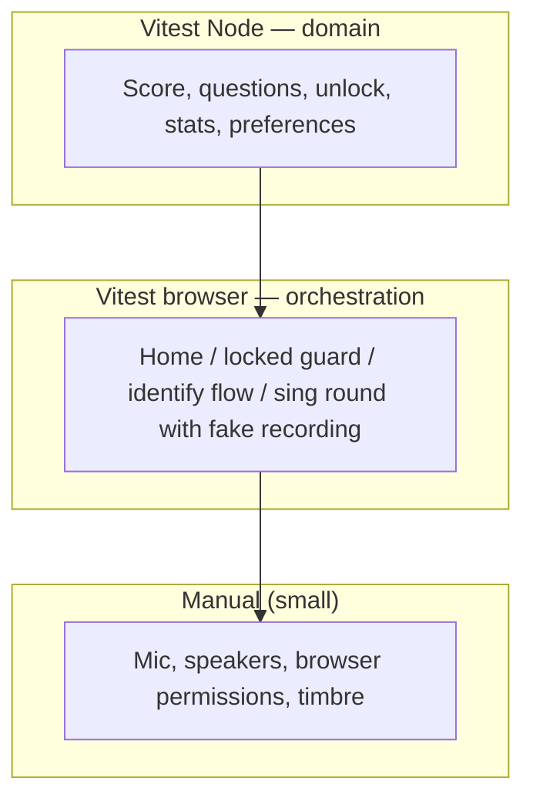

# Ear Training — Testing Roadmap

How we close the gap between strong **domain unit tests** and **no automated UI coverage**, without fighting the audio stack. Complements the [product roadmap](roadmap.md).

## Principles

Detailed rules for agents live in [`docs/agents/testing.md`](agents/testing.md) and its leaf guides: [`ui-testing.md`](agents/ui-testing.md) (browser queries) and [`mocking.md`](agents/mocking.md) (ports and test doubles). The table below summarizes; leaf docs are authoritative when they differ.

| Principle | Rationale |
|-----------|-----------|
| **Node Vitest for domain** | Scoring, chords, intervals, curriculum unlock, history stats, round logic — fast, deterministic, already in `tests/**/*.test.ts`. |
| **Real browser for UI** | Use [Vitest browser mode](https://vitest.dev/guide/browser/) (Playwright provider). **No jsdom / happy-dom** for UI — layout, focus, and gesture semantics matter. See [`ui-testing.md`](agents/ui-testing.md). |
| **Inject dependencies at mount boundaries** | `mountSingTest`, `mountIdentifyTest`, `mountHome`, `mountExercisePage`, etc. accept optional **ports** (history, audio unlock, recording). Production entrypoints wire defaults once. See [`mocking.md`](agents/mocking.md). |
| **Do not mock module internals or vendor libs** | No `vi.mock("../audio/capture")`, no mocking `smplr` / `pitchy`. Fakes implement our **ports**; exercise config already injects `prepareQuestion` / `playReference`. See [`mocking.md`](agents/mocking.md). |
| **Do not E2E real microphone or piano timbre** | Browser tests use a **fake `RecordingPort`** (canned Hz samples → real `scoreFromSamples`) and **no-op or instant `playReference`**. Manual QA covers mic permissions, latency, and sound quality. |

## Current state

| Layer | Coverage | Location |
|-------|----------|----------|
| Pitch / scoring / harmonics | Unit tests | `tests/score.test.ts`, `tests/harmonics.test.ts` |
| Notes, chords, preferences | Unit tests | `tests/notes.test.ts`, `tests/chords.test.ts`, `tests/chord-*-preference.test.ts`, `tests/voice-ranges.test.ts` |
| Intervals, rounds | Unit tests | `tests/interval-questions.test.ts`, `tests/round.test.ts` |
| History stats, curriculum | Unit tests | `tests/history-stats.test.ts`, `tests/curriculum-*.test.ts` |
| UI mount / orchestration | **Partial (T0)** | `mountHome`, `mountExercisePage`, `mountStats` accept `HistoryPort`; sing/identify still use store directly |
| Browser / Vitest projects | **Done (T0)** | `npm run test:browser` — `tests/browser/**/*.browser.test.ts` (Vitest browser + Playwright) |
| **CI (GitHub Actions)** | **Done** | [`.github/workflows/ci.yml`](../.github/workflows/ci.yml) — `npm test`, `npm run test:browser`, `npm run build` on PRs and `main` |

**Risk:** Each new exercise and curriculum feature increases manual regression surface (home cards, locked pages, round flow, `saveAttempt` fields) while domain logic stays well tested.

## Test pyramid (target)



## Dependency ports (enabler)

Extend the pattern already used in `SingTestConfig` / `IdentifyTestConfig` (`prepareQuestion`, `playReference`).

```ts
// Conceptual — see implementation PRs for exact types/paths
interface HistoryPort {
  getAllAttempts(): Promise<AttemptRecord[]>;
  saveAttempt(input: AttemptInput): Promise<void>;
}

interface AudioPort {
  unlock(): AudioContext;
  ensureReady(): Promise<AudioContext>;
  isPlaying(): boolean;
}

interface RecordingPort {
  start(callbacks: RecordingCallbacks): Promise<RecordingSession>;
  stopStream(): void;
}

interface ExerciseUiDeps {
  history: HistoryPort;
  audio: AudioPort;
  recording: RecordingPort; // identify mounts omit or no-op
}
```

- **`defaultExerciseUiDeps()`** — used from `src/pages/*.ts` and `src/main.ts`.
- **Test doubles** — in-memory history; recording that immediately `onComplete`s with fixture samples; `playReference` no-op in config or deps.

## Continuous integration (GitHub Actions)

**Today:** [`.github/workflows/ci.yml`](../.github/workflows/ci.yml) runs on every PR and `push` to `main`: Node 22, `npm ci`, `npm test`, Playwright Chromium install, `npm run test:browser`, `npm run build`. Confirm green **CI** on the PR ([`docs/agents/pull-requests.md`](agents/pull-requests.md)).

### Phase T-CI - GitHub Actions (baseline) — **Done**

**Goal:** Automated gate for domain tests and production build — no Playwright yet.

| Task | Status | Notes |
|------|--------|--------|
| Add `.github/workflows/ci.yml` | **Done** | Triggers: `push` to `main`, all `pull_request` |
| Job: `ci` — `npm ci`, `npm test`, `npm run build` | **Done** | Single job; Node 22; npm cache via `actions/setup-node` |
| Document CI in `AGENTS.md` | **Done** | PRs must pass CI; link to workflow file |
| Branch protection on `main` (repo settings) | Todo | Optional manual step: require status check **`ci`** |

### CI after browser tests (extends T0+) — **Done**

| Task | Status | Notes |
|------|--------|--------|
| Install Playwright browsers in CI | **Done** | `npx playwright install --with-deps chromium` (Linux deps for headless) |
| Run `npm run test:browser` in workflow | **Done** | Headless Chromium in the same `ci` job |
| Optional: split jobs | Todo | `test` (Node) fast; `test-browser` parallel if runtime grows |

**Defer:** Deploy previews, Codecov, matrix across Firefox/WebKit until needed.

---

## Phased plan

### Phase T0 - Foundation (tooling + first ports) — **Done**

**Goal:** Browser test project runs in CI; history injectable without IndexedDB in tests. **Depends on [T-CI](#phase-t-ci---github-actions-baseline)** for merge gates.

| Task | Status | Notes |
|------|--------|--------|
| Add `@vitest/browser-playwright`, Playwright browsers in CI | **Done** | `tests/browser/**/*.browser.test.ts`; [CI workflow](#ci-after-browser-tests-extends-t0) |
| `npm test` = Node only; `npm run test:browser` = browser project | **Done** | Documented in `AGENTS.md` / PR guide |
| Introduce `HistoryPort`; thread through `mountHome`, `mountExercisePage`, `mountStats` | **Done** | `src/history/port.ts` — `createDefaultHistoryPort()` wraps `src/history/store.ts` |
| First browser tests: locked exercise page, home card locked vs link | **Done** | `createMemoryHistoryPort()` in browser helpers; [`ui-testing.md`](agents/ui-testing.md) + [`mocking.md`](agents/mocking.md) |
| Agent testing guides (hub + UI + mocking) | **Done** | [`testing.md`](agents/testing.md), [`ui-testing.md`](agents/ui-testing.md), [`mocking.md`](agents/mocking.md) |

**Exit criteria:** CI runs Node + browser suites; curriculum guard regressions caught without manual URL typing; tests follow [`ui-testing.md`](agents/ui-testing.md) and [`mocking.md`](agents/mocking.md).

---

### Phase T1 - Identify exercise orchestration

**Goal:** Cover select-based flows (no mic) before sing recording port.

| Task | Status | Notes |
|------|--------|--------|
| `AudioPort` on `mountIdentifyTest` | Todo | Real browser can use real `AudioContext`; tests may no-op `ensureReady` |
| Browser test: interval identify — Play → choice → pass → `saveAttempt` | Todo | Fixed `prepareQuestion` in test config; assert `HistoryPort` calls |
| Browser test: round progress (question N of 10), next question | Todo | |
| Browser test: interval picker disabled / “select at least one” idle | Todo | Optional; or stay in Node if pure preference logic |

**Product tie-in:** Safe refactors while adding [Phase 2 scale-degree ID](roadmap.md#phase-2--recognition-first-modes-hear--answer-no-mic) and more MC exercises.

---

### Phase T2 - Sing exercise orchestration

**Goal:** Round/scoring/save path without `getUserMedia`.

| Task | Status | Notes |
|------|--------|--------|
| `RecordingPort` + `AudioPort` on `mountSingTest` | Todo | |
| Browser test: play → record (fake) → pass UI + history record | Todo | Canned samples near `target.hz` |
| Browser test: fail / retry / exhaust attempts copy | Todo | |
| Browser test: “not enough pitch” error path | Todo | Empty or short `samplesHz` from fake |

**Product tie-in:** Protects sing-heavy [Phase 1 level 3+](roadmap.md#phase-1--curriculum-spine-progressive-difficulty) and [Phase 3 phrase scoring](roadmap.md#phase-3--context--musicianship-still-no-rhythm).

---

### Phase T3 - Scale with product features

**Goal:** New exercises add browser cases, not new manual matrices.

| Task | Status | Notes |
|------|--------|--------|
| Shared test helpers: `mountExerciseInBrowser`, fixture history for unlock states | Todo | |
| Browser smoke per new `exerciseId` in registry | Todo | At minimum: mount + one happy path |
| Dev `?unlock=all` (product roadmap) | Todo | Reduces manual path grinding; document in [manual QA checklist](#manual-qa-still-required) |
| Contract test: registry `mount` + configs expose required `exerciseId` | Todo | Node or browser; catches registry drift |

**Defer:** Visual regression, multi-browser matrix (start Chromium only), performance profiling.

---

### Phase T4 - Optional hardening

| Task | Status | Notes |
|------|--------|--------|
| Stats page browser test (table rows per exercise) | Todo | After weakness-by-tag UI stabilizes |
| `localStorage` preference round-trip | Todo | Node or browser; isolate key prefix for tests |
| Preview deploy smoke (GitHub Action + Playwright) | Optional | Only if browser suite is stable and fast |

## What stays manual

- Microphone permission UX and hardware variation  
- Headphone vs speaker bleed, piano sample feel  
- iOS Safari audio unlock edge cases (gesture timing)  
- Full cross-browser matrix (unless we explicitly expand CI)  

Use a short **manual QA checklist** on PRs that touch `src/ui/`, `src/audio/`, or curriculum — see [`docs/agents/pull-requests.md`](agents/pull-requests.md).

## CI commands (target)

**Local:**

```bash
npm test              # Vitest Node — domain (existing)
npm run test:browser  # Vitest browser — UI orchestration (T0)
npm run build         # unchanged; run when routes/assets change
```

**GitHub Actions:** [`.github/workflows/ci.yml`](../.github/workflows/ci.yml) runs `npm test`, `npm run test:browser`, and `npm run build` on every PR and `main`.

## Suggested implementation order

Align with product work; testing phases can run **in parallel** with feature PRs once CI exists.

0. ~~[T-CI](#phase-t-ci---github-actions-baseline)~~ — **Done** — GitHub Actions: `npm test` + `npm run build` on every PR and `main`  
1. ~~[T0](#phase-t0---foundation-tooling--first-ports)~~ — **Done** — browser project + `HistoryPort` + home / locked-page tests + Playwright in CI  
2. **[T1](#phase-t1---identify-exercise-orchestration) — next** — identify orchestration (interval ID today; template for future MC exercises)  
3. [T2](#phase-t2---sing-exercise-orchestration) — sing orchestration with fake recording  
4. [T3](#phase-t3---scale-with-product-features) — helpers + per-exercise smoke as registry grows  

## Related product roadmap items

| Product item | Testing track |
|--------------|---------------|
| PR merge confidence | **Done** ([T-CI](#phase-t-ci---github-actions-baseline) + browser job in [T0](#phase-t0---foundation-tooling--first-ports)) |
| Curriculum guards, home UI | **Done** ([T0](#phase-t0---foundation-tooling--first-ports)) |
| Interval + future identify exercises | [T1](#phase-t1---identify-exercise-orchestration) |
| Sing / phrase / reproduction | [T2](#phase-t2---sing-exercise-orchestration) |
| Unified `ExerciseDefinition` | Ports + config injection; browser tests use test configs |
| `?unlock=all` for QA | [T3](#phase-t3---scale-with-product-features) + manual checklist |

---

## Explicitly out of scope (testing)

- Automated scoring of real sung audio in CI  
- Mocking `pitchy` / `smplr` in UI tests  
- jsdom/happy-dom UI tests  
- Replacing domain unit tests with browser tests  
