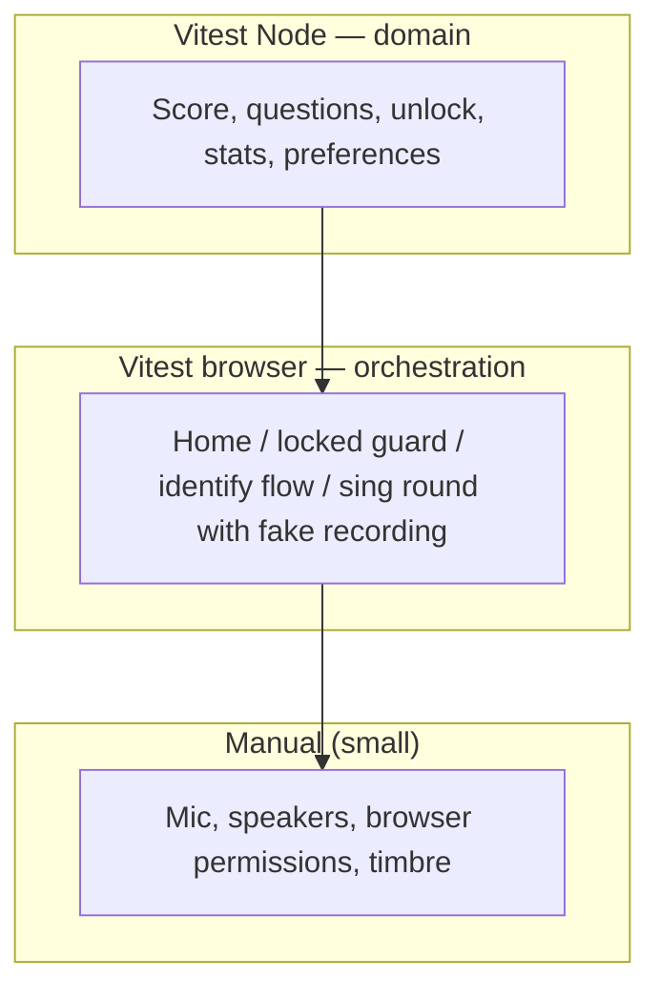

# Ear Training — Testing Roadmap

How we close the gap between strong **domain unit tests** and **no automated UI coverage**, without fighting the audio stack. Complements the [product roadmap](roadmap.md).

## Principles

| Principle | Rationale |
|-----------|-----------|
| **Node Vitest for domain** | Scoring, chords, intervals, curriculum unlock, history stats, round logic — fast, deterministic, already in `tests/**/*.test.ts`. |
| **Real browser for UI** | Use [Vitest browser mode](https://vitest.dev/guide/browser/) (Playwright provider). **No jsdom / happy-dom** for UI — layout, focus, and gesture semantics matter. |
| **Inject dependencies at mount boundaries** | `mountSingTest`, `mountIdentifyTest`, `mountHome`, `mountExercisePage`, etc. accept optional **ports** (history, audio unlock, recording). Production entrypoints wire defaults once. |
| **Do not mock module internals or vendor libs** | No `vi.mock("../audio/capture")`, no mocking `smplr` / `pitchy`. Fakes implement our **ports**; exercise config already injects `prepareQuestion` / `playReference`. |
| **Do not E2E real microphone or piano timbre** | Browser tests use a **fake `RecordingPort`** (canned Hz samples → real `scoreFromSamples`) and **no-op or instant `playReference`**. Manual QA covers mic permissions, latency, and sound quality. |

## Current state

| Layer | Coverage | Location |
|-------|----------|----------|
| Pitch / scoring / harmonics | Unit tests | `tests/score.test.ts`, `tests/harmonics.test.ts` |
| Notes, chords, preferences | Unit tests | `tests/notes.test.ts`, `tests/chords.test.ts`, `tests/chord-*-preference.test.ts`, `tests/voice-ranges.test.ts` |
| Intervals, rounds | Unit tests | `tests/interval-questions.test.ts`, `tests/round.test.ts` |
| History stats, curriculum | Unit tests | `tests/history-stats.test.ts`, `tests/curriculum-*.test.ts` |
| UI mount / orchestration | **None** | `src/ui/*.ts` import audio + history directly |
| Browser / Vitest projects | **Not configured** | Single `npm test` → Node only (`vite.config.ts`) |
| **CI (GitHub Actions)** | **None** | No `.github/workflows/`; tests and build are local-only today |

**Risk:** Each new exercise and curriculum feature increases manual regression surface (home cards, locked pages, round flow, `saveAttempt` fields) while domain logic stays well tested.

## Test pyramid (target)



## Dependency ports (enabler)

Extend the pattern already used in `SingTestConfig` / `IdentifyTestConfig` (`prepareQuestion`, `playReference`).

```ts
// Conceptual — see implementation PRs for exact types/paths
interface HistoryPort {
  getAllAttempts(): Promise<AttemptRecord[]>;
  saveAttempt(input: AttemptInput): Promise<void>;
}

interface AudioPort {
  unlock(): AudioContext;
  ensureReady(): Promise<AudioContext>;
  isPlaying(): boolean;
}

interface RecordingPort {
  start(callbacks: RecordingCallbacks): Promise<RecordingSession>;
  stopStream(): void;
}

interface ExerciseUiDeps {
  history: HistoryPort;
  audio: AudioPort;
  recording: RecordingPort; // identify mounts omit or no-op
}
```

- **`defaultExerciseUiDeps()`** — used from `src/pages/*.ts` and `src/main.ts`.
- **Test doubles** — in-memory history; recording that immediately `onComplete`s with fixture samples; `playReference` no-op in config or deps.

## Continuous integration (GitHub Actions)

**Today:** No workflow runs on push or PR. Contributors must run `npm test` and `npm run build` locally ([`docs/agents/pull-requests.md`](agents/pull-requests.md)).

**Goal:** Every PR and `main` get a fast, deterministic check before merge; browser tests join the same workflow once T0 lands.

### Phase T-CI - GitHub Actions (baseline)

**Goal:** Automated gate for domain tests and production build — no Playwright yet.

| Task | Status | Notes |
|------|--------|--------|
| Add `.github/workflows/ci.yml` | Todo | Triggers: `push` to `main`, all `pull_request` |
| Job: `test` — `npm ci`, `npm test` | Todo | Node 22 (or repo LTS); cache `npm` via `actions/setup-node` |
| Job: `build` — `npm ci`, `npm run build` | Todo | Same checkout; can be one job with both steps or parallel jobs |
| Document CI in `AGENTS.md` | Todo | PRs must pass CI; link to workflow file |
| Branch protection on `main` (repo settings) | Todo | Require `test` / `build` (or single `ci` job) status checks |

**Example workflow shape (implementation PR):**

```yaml
name: CI
on:
  push:
    branches: [main]
  pull_request:
jobs:
  ci:
    runs-on: ubuntu-latest
    steps:
      - uses: actions/checkout@v4
      - uses: actions/setup-node@v4
        with:
          node-version: "22"
          cache: npm
      - run: npm ci
      - run: npm test
      - run: npm run build
```

**Exit criteria:** Green check on PRs without manual “trust me, tests pass.”

### CI after browser tests (extends T0+)

| Task | Status | Notes |
|------|--------|--------|
| Install Playwright browsers in CI | Todo | `npx playwright install --with-deps chromium` (Linux deps for headless) |
| Run `npm run test:browser` in workflow | Todo | After `test:browser` script exists; headless Chromium only to start |
| Optional: split jobs | Todo | `test` (Node) fast; `test-browser` parallel if runtime grows |

**Defer:** Deploy previews, Codecov, matrix across Firefox/WebKit until needed.

---

## Phased plan

### Phase T0 - Foundation (tooling + first ports)

**Goal:** Browser test project runs in CI; history injectable without IndexedDB in tests. **Depends on [T-CI](#phase-t-ci---github-actions-baseline)** for merge gates (or land T-CI in the same PR as the first browser test).

| Task | Status | Notes |
|------|--------|--------|
| Add `@vitest/browser-playwright`, Playwright browsers in CI | Todo | Separate Vitest project, e.g. `tests/browser/**/*.browser.test.ts`; extend [CI workflow](#ci-after-browser-tests-extends-t0) |
| `npm test` = Node only; `npm run test:browser` = browser project | Todo | Document in `AGENTS.md` / PR guide |
| Introduce `HistoryPort`; thread through `mountHome`, `mountExercisePage`, `mountStats` | Todo | `createDefaultHistoryPort()` wraps `src/history/store.ts` |
| First browser tests: locked exercise page, home card locked vs link | Todo | Seed fake history port; assert DOM via `vitest/browser` `userEvent` / `expect.element` |

**Exit criteria:** CI runs Node + browser suites; curriculum guard regressions caught without manual URL typing.

---

### Phase T1 - Identify exercise orchestration

**Goal:** Cover select-based flows (no mic) before sing recording port.

| Task | Status | Notes |
|------|--------|--------|
| `AudioPort` on `mountIdentifyTest` | Todo | Real browser can use real `AudioContext`; tests may no-op `ensureReady` |
| Browser test: interval identify — Play → choice → pass → `saveAttempt` | Todo | Fixed `prepareQuestion` in test config; assert `HistoryPort` calls |
| Browser test: round progress (question N of 10), next question | Todo | |
| Browser test: interval picker disabled / “select at least one” idle | Todo | Optional; or stay in Node if pure preference logic |

**Product tie-in:** Safe refactors while adding [Phase 2 scale-degree ID](roadmap.md#phase-2--recognition-first-modes-hear--answer-no-mic) and more MC exercises.

---

### Phase T2 - Sing exercise orchestration

**Goal:** Round/scoring/save path without `getUserMedia`.

| Task | Status | Notes |
|------|--------|--------|
| `RecordingPort` + `AudioPort` on `mountSingTest` | Todo | |
| Browser test: play → record (fake) → pass UI + history record | Todo | Canned samples near `target.hz` |
| Browser test: fail / retry / exhaust attempts copy | Todo | |
| Browser test: “not enough pitch” error path | Todo | Empty or short `samplesHz` from fake |

**Product tie-in:** Protects sing-heavy [Phase 1 level 3+](roadmap.md#phase-1--curriculum-spine-progressive-difficulty) and [Phase 3 phrase scoring](roadmap.md#phase-3--context--musicianship-still-no-rhythm).

---

### Phase T3 - Scale with product features

**Goal:** New exercises add browser cases, not new manual matrices.

| Task | Status | Notes |
|------|--------|--------|
| Shared test helpers: `mountExerciseInBrowser`, fixture history for unlock states | Todo | |
| Browser smoke per new `exerciseId` in registry | Todo | At minimum: mount + one happy path |
| Dev `?unlock=all` (product roadmap) | Todo | Reduces manual path grinding; document in [manual QA checklist](#manual-qa-still-required) |
| Contract test: registry `mount` + configs expose required `exerciseId` | Todo | Node or browser; catches registry drift |

**Defer:** Visual regression, multi-browser matrix (start Chromium only), performance profiling.

---

### Phase T4 - Optional hardening

| Task | Status | Notes |
|------|--------|--------|
| Stats page browser test (table rows per exercise) | Todo | After weakness-by-tag UI stabilizes |
| `localStorage` preference round-trip | Todo | Node or browser; isolate key prefix for tests |
| Preview deploy smoke (GitHub Action + Playwright) | Optional | Only if browser suite is stable and fast |

## What stays manual

- Microphone permission UX and hardware variation  
- Headphone vs speaker bleed, piano sample feel  
- iOS Safari audio unlock edge cases (gesture timing)  
- Full cross-browser matrix (unless we explicitly expand CI)  

Use a short **manual QA checklist** on PRs that touch `src/ui/`, `src/audio/`, or curriculum — see [`docs/agents/pull-requests.md`](agents/pull-requests.md).

## CI commands (target)

**Local:**

```bash
npm test              # Vitest Node — domain (existing)
npm run test:browser  # Vitest browser — UI orchestration (T0)
npm run build         # unchanged; run when routes/assets change
```

**GitHub Actions (after [T-CI](#phase-t-ci---github-actions-baseline)):** same commands in `.github/workflows/ci.yml` on every PR and `main`.

## Suggested implementation order

Align with product work; testing phases can run **in parallel** with feature PRs once CI exists.

0. [T-CI](#phase-t-ci---github-actions-baseline) — GitHub Actions: `npm test` + `npm run build` on every PR *(do this first; no app code changes)*  
1. [T0](#phase-t0---foundation-tooling--first-ports) — browser project + `HistoryPort` + home / locked-page tests + Playwright in CI  
2. [T1](#phase-t1---identify-exercise-orchestration) — identify orchestration (interval ID today; template for future MC exercises)  
3. [T2](#phase-t2---sing-exercise-orchestration) — sing orchestration with fake recording  
4. [T3](#phase-t3---scale-with-product-features) — helpers + per-exercise smoke as registry grows  

## Related product roadmap items

| Product item | Testing track |
|--------------|---------------|
| PR merge confidence | [T-CI](#phase-t-ci---github-actions-baseline) |
| Curriculum guards, home UI | [T0](#phase-t0---foundation-tooling--first-ports) |
| Interval + future identify exercises | [T1](#phase-t1---identify-exercise-orchestration) |
| Sing / phrase / reproduction | [T2](#phase-t2---sing-exercise-orchestration) |
| Unified `ExerciseDefinition` | Ports + config injection; browser tests use test configs |
| `?unlock=all` for QA | [T3](#phase-t3---scale-with-product-features) + manual checklist |

---

## Explicitly out of scope (testing)

- Automated scoring of real sung audio in CI  
- Mocking `pitchy` / `smplr` in UI tests  
- jsdom/happy-dom UI tests  
- Replacing domain unit tests with browser tests  
